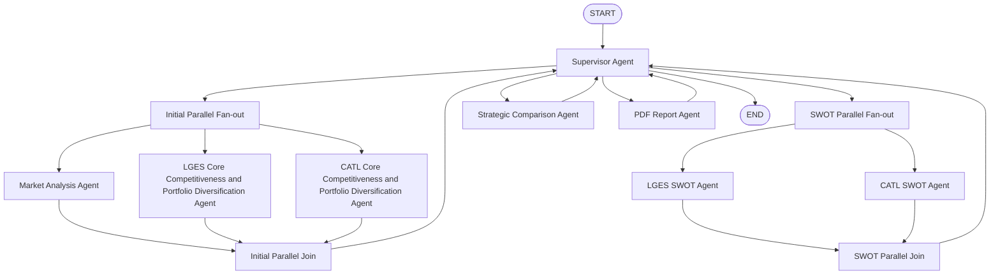

<div align="center">

<h1>Battery Market Strategy Analysis Agent</h1>

<p>
  <strong>PDF·웹 RAG 기반 정보 추출</strong> + <strong>멀티 에이전트 분석</strong> + <strong>배터리 시장 전략 보고서 자동 생성</strong>
</p>

<p>
  
  
  
  
  
</p>


</div>

---

LG에너지솔루션(LGES)과 CATL 두 기업의 배터리 관련 PDF·웹 자료를 기반으로 시장 파악, 핵심 기술력·다각화 전략을 분석하고, SWOT·전략 비교를 수행한 뒤 객관적 데이터 기반의 배터리 시장 전략 보고서(MD/PDF)를 자동 생성하는 멀티에이전트 시스템이다. LangGraph로 워크플로를 구성하고, FAISS RAG·Tavily 웹 검색·구조화 출력을 활용하며, 반복 검증·편향 점검·리트라이 한도로 품질을 관리한다.

## Overview

- **Objective** : LGES·CATL의 배터리 산업 시장·기술력·다각화 전략을 조사하고, 전략적 차이·강약점을 객관적 데이터 기반으로 분석한 배터리 시장 전략 보고서를 자동 작성한다.
- **Method** : Supervisor가 단계별 워크플로(초기 병렬 → SWOT 병렬 → 비교 → 보고서)를 제어하고, 시장·회사별 RAG·SWOT·비교·리포트 에이전트가 병렬/직렬로 실행되며, 검색·리트라이·품질 평가로 결과를 보정한다.
- **Tools** : LangGraph, LangChain, OpenAI API(GPT), FAISS, HuggingFace Embeddings(BGE-M3), PyPDF, Tavily API, ReportLab

## Features

- **PDF 자료 기반 정보 추출** : 회사별 PDF(LGES.pdf, CATL.pdf)를 PyPDF로 로드·청킹 후 FAISS에 인덱싱하고, Agentic RAG로 질의 계획·추가 검색·반영(reflection)을 수행해 핵심 기술력·다각화 전략을 추출한다.
- **웹 검색 기반 시장 분석** : Tavily API로 배터리 시장·EV/ESS 수요·지역 정책·가격 경쟁·공급 과잉 등 쿼리를 검색하고, 검색 스니펫만 사용해 시장 분석 에이전트가 시장 관점·근거·참조를 구조화 출력으로 생성한다.
- **병렬 실행** : 초기 단계에서 시장 분석·LGES 코어·CATL 코어 에이전트를 병렬 실행하고, SWOT 단계에서 LGES SWOT·CATL SWOT을 병렬 실행해 지연을 줄인다.
- **구조화 출력** : 시장·회사·SWOT·비교·리포트 각 단계에서 Pydantic 스키마(MarketAnalysisOutput, CompanyAnalysisOutput, SWOTOutput, ComparisonOutput, ReportOutput)로 고정 형식 출력을 받아 상태에 반영한다.
- **검색·품질 평가 및 리트라이** : 각 에이전트 결과에 대해 `search_evaluation`(verdict: approved/revise/retrieve/exhausted)과 `max_retry`/`max_revision`으로 리트라이 한도를 두고, Supervisor가 미승인 시 해당 단계를 재실행하도록 한다.
- **확증 편향 방지 전략** : (1) 시장·회사·리포트 스키마에 `missing_points`, `bias_checks`, `revision_needed` 필드를 두어 LLM이 보완·편향 점검·수정 필요 여부를 출력하게 하고, (2) Agentic RAG 반영 단계에서 회사 PDF만으로는 부족한 경우 웹으로 “회사명 + diversification risks / headwinds / counter evidence”를 검색해 반대 증거 스니펫을 함께 주입하고, (3) 리트라이/리비전 한도 내에서만 재검색·재분석을 수행해 과도한 확증 추구를 막는다.

## Tech Stack

| Category   | Details                                      |
|------------|----------------------------------------------|
| Framework  | LangGraph, LangChain, Python                 |
| LLM        | GPT-4.1-mini (OpenAI API, env: OPENAI_MODEL) |
| Retrieval  | FAISS (로컬 인덱스, 회사별 디렉터리)         |
| Embedding  | BAAI/bge-m3 (HuggingFace, env: EMBEDDING_MODEL) |
| PDF        | PyPDF (로드), ReportLab (보고서 PDF 렌더링)  |
| Web Search | Tavily API (tavily-python)                   |

## Agents

- **Supervisor Agent** : 워크플로 단계(init → initial_parallel → swot_parallel → comparison → reporting → done)를 결정하고, 각 단계 결과의 `ready`·`search_evaluation`을 확인해 리트라이 요청이 있으면 해당 단계를 유지, 없으면 다음 단계로 진행한다.
- **Market Analysis Agent** : Tavily 웹 검색 결과만 사용해 배터리 산업 시장 분석(시장 관점, 근거, 참조, missing_points, bias_checks, revision_needed)을 작성하고, 검색 평가 상태를 갱신한다.
- **LGES Core Portfolio Agent / CATL Core Portfolio Agent** : 회사별 PDF에 대해 FAISS 인덱스 유지·Agentic RAG(질의 계획 → 검색 → 반영·팔로업 쿼리)를 수행하고, 핵심 기술력·다각화 전략을 구조화 출력으로 정리하며, RAG 반영 시 웹 반대 증거 스니펫을 함께 활용한다.
- **LGES SWOT Agent / CATL SWOT Agent** : 시장 분석·해당 회사 코어 분석 결과만 사용해 강점·약점·기회·위협을 구조화 출력으로 생성한다.
- **Strategic Comparison Agent** : 시장·양사 코어·양사 SWOT 결과를 종합해 전략적 차이, 강약점 비교, 종합 결론을 작성한다.
- **PDF Report Agent** : 위 모든 분석을 입력으로 보고서 제목·요약·마크다운 본문을 생성하고, PDF 변환용 프롬프트로 구조 정규화 후 ReportLab으로 MD/PDF를 저장하며, 품질 체크·search_evaluation을 갱신한다.

## Architecture

아래 Mermaid 플로우는 Supervisor 중심의 단계별 라우팅과 병렬/직렬 실행을 나타낸다.



## Directory Structure

```
Battery-Market-Strategy-Analysis-Agent/
├── data/                        # PDF 문서 (LGES.pdf, CATL.pdf 등, env: DATA_DIR)
├── output/                      # 평가 결과·보고서·로그 (env: OUTPUT_DIR)
│   ├── battery_strategy_report.md
│   ├── battery_strategy_report.pdf          # 기본 테마 PDF
│   ├── battery_strategy_report_premium.pdf  # 프리미엄 UI 테마 PDF (선택)
│   └── logs/
├── poc_graph/                   # 메인 패키지
│   ├── agents/                  # Agent 모듈
│   │   ├── base.py
│   │   ├── company.py           # LGES/CATL Core Portfolio
│   │   ├── market.py
│   │   ├── swot.py
│   │   ├── comparison.py
│   │   ├── report.py
│   │   └── supervisor.py
│   ├── orchestration/           # 병렬 Fan-out/Join 노드
│   ├── services/                # RAG, 벡터스토어, LLM, 웹검색, 리포트 (ReportService + PremiumReportService)
│   ├── config.py                # 환경 변수 기반 설정
│   ├── schemas.py               # Pydantic 출력 스키마
│   ├── state_models.py          # 그래프 상태 타입
│   ├── state_factory.py         # 초기 상태 생성
│   ├── execution_state.py       # 검색 평가·리트라이 로직
│   ├── spec.py                  # 그래프 노드/엣지/메르마이드/프롬프트 상수
│   ├── builder.py               # LangGraph 빌드
│   ├── runner.py                # 시뮬레이션 실행·트레이스
│   ├── registry.py              # 서비스·에이전트 의존성 등록
│   ├── __main__.py              # 실행 진입점 (python -m poc_graph)
│   └── render_pdf.py             # MD → 프리미엄 UI PDF (standalone)
├── requirements.txt
├── .env / key.env               # OPENAI_API_KEY, TAVILY_API_KEY 등 (참고: key.env 우선)
└── README.md
```

## PDF 출력 버전

- **기본 PDF** (`battery_strategy_report.pdf`): 파이프라인 실행 시 생성. 블루/화이트 투자 보고서(SMIC) 스타일.
- **프리미엄 UI PDF** (`battery_strategy_report.pdf`): 마크다운만 읽어서 동일 파일명으로 프리미엄 테마 PDF 생성.
  ```bash
  python -m poc_graph.render_pdf
  python -m poc_graph.render_pdf path/to/report.md
  ```

## Contributors

- 김철수 : Prompt Engineering, Agent Design
- 최영희 : PDF Parsing, Retrieval Agent

*(실제 기여자명으로 수정하여 사용하세요.)*
