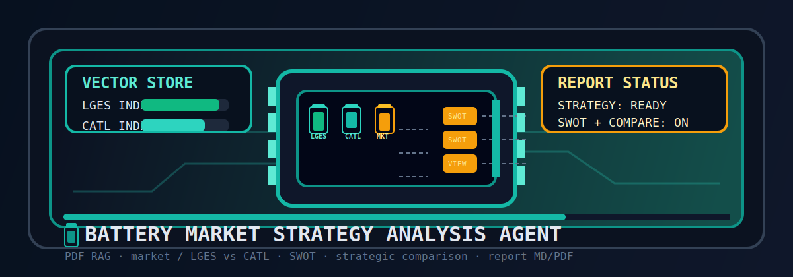
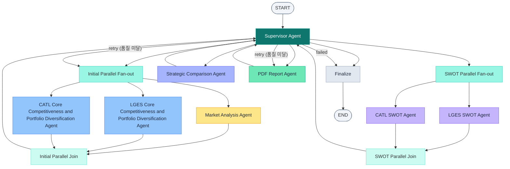

<div align="center">

<h1>Battery Market Strategy Analysis Agent</h1>

<p>
  <strong>PDF &amp; 웹 RAG 기반 정보 추출</strong> + <strong>멀티 에이전트 분석</strong> + <strong>배터리 시장 전략 보고서 자동 생성</strong>
</p>

<p>
  
  
  
  
  
</p>




</div>

---

이 프로젝트는 LG에너지솔루션(LGES)과 CATL 두 기업의 배터리 시장 전략을 자동으로 분석하고, 그 결과를 구조화된 보고서(MD/PDF)로 출력하는 멀티에이전트 시스템입니다. 단순히 정보를 모아 요약하는 것에 그치지 않고, 시장 흐름 → 회사별 핵심 역량 → SWOT → 전략 비교로 이어지는 분석 흐름을 LangGraph 워크플로 위에서 자동으로 구현합니다.

## 목차

1. [Overview](#1-overview)
2. [Features](#2-features)
3. [Architecture](#3-architecture)
4. [Multi Agents](#4-multi-agents)
5. [Reflection 설계](#5-reflection-설계)
6. [Tech Stack](#6-tech-stack)
7. [Directory Structure](#7-directory-structure)
8. [Goal Setting & Criteria Design](#8-goal-setting--criteria-design)
9. [Lessons Learned](#9-lessons-learned)
10. [Contributors](#10-contributors)

---

## 1. Overview

이 시스템의 핵심 목표는 두 가지입니다. 첫째, LGES와 CATL의 공식 PDF 자료와 실시간 웹 데이터를 결합해 배터리 시장에서의 기술력, 다각화 전략, 경쟁 우위를 객관적으로 파악합니다. 둘째, 단일 LLM 호출이 아닌 역할이 분리된 여러 에이전트가 단계적으로 협력함으로써, 분석의 편향을 줄이고 품질을 스스로 검증하는 구조를 만듭니다.

워크플로는 Supervisor가 전체를 관리하며, 초기 병렬 분석(시장, LGES, CATL) → SWOT 병렬 분석 → 전략 비교 → 보고서 생성의 순서로 진행됩니다. 각 단계의 출력은 즉시 다음 단계로 넘어가지 않고 품질 평가와 리트라이를 거쳐 Supervisor에게 반환됩니다.

사용 기술로는 LangGraph, LangChain, GPT-4.1-mini, FAISS, HuggingFace BGE-M3 임베딩, Tavily 웹검색, ReportLab이 있습니다.

---

## 2. Features

시스템이 제공하는 주요 기능은 크게 세 가지 관점에서 이해할 수 있습니다.

**정보 수집 측면**에서는 회사별 PDF를 로드해 청킹 및 FAISS 인덱싱한 뒤 Agentic RAG로 핵심 기술력과 다각화 전략을 추출하고, Tavily API로 EV 및 ESS 수요, 지역 정책 등 최신 시장 정보를 실시간으로 보완합니다.

**실행 효율 측면**에서는 시장 분석과 LGES 및 CATL 코어 분석을 동시에 병렬 실행하고, 이후 SWOT 분석도 두 회사에 대해 동시에 수행해 전체 소요 시간을 단축합니다. 각 단계의 출력은 Pydantic 스키마로 형식이 고정되어 있어, 다음 에이전트가 파싱 오류 없이 안정적으로 입력을 받을 수 있습니다.

**품질 보장 측면**에서는 각 에이전트가 자신의 출력을 스스로 평가하고 미달 시 재검색 또는 재작성 루프에 진입하며, 확증 편향을 막기 위해 반대 증거를 의도적으로 프롬프트에 추가하는 구조를 갖추고 있습니다.

---

## 3. Architecture

Supervisor를 중심으로 전체 워크플로가 단계별로 흐름이 제어됩니다. 각 Phase는 병렬 Fan-out으로 시작해 결과를 Join한 뒤 Supervisor로 돌아오며, Supervisor는 품질 평가 결과를 보고 다음 단계로 진행할지 재실행할지를 결정합니다.



---

## 4. Multi Agents

각 에이전트는 명확히 분리된 책임을 가집니다.

| Agent | Description |
|---|---|
| **Supervisor Agent** | 전체 흐름을 제어합니다. 각 단계의 `ready` 상태와 `search_evaluation` 결과를 확인하고, 리트라이 여부에 따라 단계를 유지하거나 다음 단계로 전진합니다. |
| **Market Analysis Agent** | Tavily 웹검색으로 배터리 산업의 시장 동향을 수집하고, 구조화된 시장 분석 출력(`missing_points`, `bias_checks`, `revision_needed` 포함)으로 정리합니다. |
| **LGES / CATL Core Portfolio Agent** | 각 회사의 PDF를 FAISS로 인덱싱하고 Agentic RAG를 수행해 핵심 기술력과 다각화 전략을 추출합니다. 필요 시 외부 웹 반대 증거 스니펫을 함께 활용해 편향을 줄입니다. |
| **LGES / CATL SWOT Agent** | 앞 단계에서 승인된 시장 분석과 해당 회사의 코어 분석 결과를 입력으로 받아 강점, 약점, 기회, 위협을 구조화 출력으로 생성합니다. |
| **Strategic Comparison Agent** | 시장, 양사 코어, 양사 SWOT 결과를 모두 종합해 전략적 차이와 강약점 비교, 종합 결론을 작성합니다. |
| **PDF Report Agent** | 위 모든 분석을 바탕으로 보고서 제목, 요약, 마크다운 본문을 생성하고, ReportLab으로 MD와 PDF 파일을 저장합니다. 저장 후에는 품질 체크와 `search_evaluation` 업데이트까지 수행합니다. |

---

## 5. Reflection 설계

이 시스템의 품질 관리 핵심은 단순한 출력 검증이 아니라, **에이전트가 스스로 자신의 출력을 반성하고 부족하면 재시도하는 이중 반성 체계**입니다.

### 5.1 적용 에이전트

Reflection은 분석 품질이 중요한 세 에이전트에 각각 다른 방식으로 적용됩니다.

| 에이전트 | Reflection 방식 |
|---|---|
| Market Analysis Agent | LLM 자기반성(`MarketAnalysisOutput`) + 규칙 기반(`assess_market_output`) 결합, `SearchEvaluationState`로 리트라이 관리 |
| LGES / CATL Core Portfolio Agent | LLM 자기반성(`CompanyAnalysisOutput`) + 규칙 기반(`assess_company_output`) 결합, Agentic RAG 내 `RetrievalReflectionOutput`과 연결 |
| PDF Report Agent | `ReportOutput` 스키마의 `missing_points`, `bias_checks`, `revision_needed` + 필수 섹션 및 참조 보유 여부를 점검하는 `quality_check`로 재작성 여부 결정 |

SWOT Agent와 Strategic Comparison Agent는 이미 승인된 출력만 입력으로 받기 때문에 별도의 Reflection 루프를 두지 않습니다.

### 5.2 이중 반성 체계

반성은 두 단계에서 동시에 이루어집니다.

첫 번째는 **LLM 자기반성**입니다. 각 에이전트의 Pydantic 출력 스키마에는 `missing_points`, `bias_checks`, `missing_dimensions`, `failure_type`, `recommended_action`, `revision_needed` 같은 자기평가 필드가 포함되어 있습니다. LLM은 분석 결과를 생성하는 동시에 자신의 약점과 보완 방향을 구조화된 형태로 함께 반환합니다.

두 번째는 **규칙 기반 반성**(`reflection_utils.py`)입니다. 이 검증 단계는 출력 텍스트에 대해 분석 범위 키워드 확인, 중복 bullet 감지, 수치 지원 여부, 참조 출처 다양성 등을 규칙으로 독립적으로 검증합니다.

두 결과는 `build_reflection()`에서 합쳐집니다. 중요한 점은 LLM이 `accept`를 반환하더라도 규칙 검사에서 `missing_points`가 발견되면 `retry_rewrite`로 높아진다는 것입니다. LLM의 자기평가가 지나치게 너그러울 수 있다는 한계를 규칙 검증 단계가 보완하는 구조입니다.

### 5.3 긍/부정 균형 체크

회사 PDF는 본질적으로 긍정적 정보가 지배적입니다. 이를 그대로 수집하면 SWOT의 강점만 채워지고 약점과 위협은 빈약해지는 문제가 생깁니다. 이를 막기 위해 세 가지 장치를 설계했습니다.

Agentic RAG가 6개의 검색 쿼리를 계획할 때 마지막 버킷은 반드시 "risks, limits, or counter-evidence inside the company document"로 고정됩니다. 또한 RAG 반성 단계에서 외부 웹으로부터 반대 증거 스니펫을 추가로 수집해 프롬프트에 추가합니다. 마지막으로, 출력 스키마의 `bias_checks` 필드를 통해 LLM이 자신의 출력에서 편향 가능성을 직접 기술하도록 합니다.

### 5.4 분석 범위 정의

에이전트별로 반드시 다뤄야 할 분석 항목을 사전에 명시하고, 다루지 못한 항목을 `missing_dimensions`로 기록해 다음 시도의 프롬프트에 추가합니다. LLM이 쓰기 쉬운 내용만 채우는 것을 방지하기 위한 장치입니다.

| 에이전트 | 필수 차원 | 선택 차원 |
|---|---|---|
| Market Analysis | EV 수요, ESS 수요, 정책/현지화 | 가격/수익성, 공급/생산능력, 리스크/역풍 |
| Company Core (LGES/CATL) | 기술/화학계, 생산거점/실행, 고객/제품, ESS/비EV 확장 | 공급망/재활용/서비스 |

### 5.5 Failure Type 분류

재시도 전략을 명확히 하기 위해 `failure_type`을 6가지로 분류합니다. `insufficient_coverage`나 `weak_grounding`처럼 정보 자체가 부족한 경우에는 재검색(`retry_retrieve`)을, `redundant_evidence`나 `missing_numeric_support`처럼 내용 구성 문제인 경우에는 재작성(`retry_rewrite`)을 선택합니다.

| failure_type | 의미 | 재시도 액션 |
|---|---|---|
| `insufficient_coverage` | 필수 분석 항목 미충족 | `retry_retrieve` |
| `weak_grounding` | evidence 수 부족 또는 근거 페이지 치우침 | `retry_retrieve` |
| `source_concentration` | 참조한 웹 사이트 다양성 부족 | `retry_retrieve` |
| `redundant_evidence` | bullet 간 중복 및 재진술 | `retry_rewrite` |
| `missing_numeric_support` | 수치 및 날짜 등 숫자 근거 없음 | `retry_rewrite` |
| `format_issue` | 필수 섹션 누락 등 형식 오류 | `retry_rewrite` |

### 5.6 SearchEvaluationState와 리트라이 한도

리트라이 결과는 `SearchEvaluationState`로 관리됩니다. Supervisor는 `should_retry()`, `is_exhausted()`, `is_approved()` 메서드로 다음 진행 경로를 결정하며, 재시도 시에는 `last_reason`과 `missing_dimensions`를 `revision_guidance`로 프롬프트에 추가해 다음 시도의 품질을 유도합니다. `max_retry`와 `max_revision` 한도를 초과하면 `exhausted` 상태로 전환해 무한 루프를 방지합니다.

- `verdict`: `pending` → `approved` / `revise` / `retrieve` / `exhausted`
- `retry_count` / `max_retry`: 리트라이 횟수 추적 및 한도 초과 시 `exhausted`로 전환
- `revision_count` / `max_revision`: 재작성 횟수 별도 추적

---

## 6. Tech Stack

| Category          | Details                                         |
|-------------------|-------------------------------------------------|
| Framework         | LangGraph, LangChain, Python                    |
| LLM               | GPT-4.1-mini (OpenAI API)                       |
| Retrieval         | FAISS (로컬 인덱스, 회사별 디렉터리)             |
| Embedding         | BAAI/bge-m3 (HuggingFace)                       |
| Web Search        | Tavily API                                      |
| PDF Parsing       | PyPDF                                           |
| Report Generation | ReportLab (MD/PDF 저장)                         |

---

## 7. Directory Structure

```
Battery-Market-Strategy-Analysis-Agent/
├── data/                      # PDF 문서 (LGES.pdf, CATL.pdf 등, env: DATA_DIR)
├── output/                    # 평가 결과, 보고서, 로그 (env: OUTPUT_DIR)
│   ├── battery_strategy_report.md
│   ├── battery_strategy_report.pdf
│   └── logs/
├── battery_market_strategy/   # 메인 패키지
│   ├── agents/                # Agent 모듈 (base, company, market, swot, comparison, report, supervisor)
│   ├── orchestration/         # 병렬 Fan-out/Join 노드
│   ├── services/              # RAG, 벡터스토어, LLM, 웹검색, 리포트
│   ├── config.py              # 환경 변수 기반 설정
│   ├── schemas.py             # Pydantic 출력 스키마
│   ├── state_models.py        # 그래프 상태 타입
│   ├── state_factory.py       # 초기 상태 생성
│   ├── execution_state.py     # 검색 평가, 리트라이 로직
│   ├── spec.py                # 그래프 노드/엣지/프롬프트 상수
│   ├── builder.py             # LangGraph 빌드
│   ├── graph.py               # 그래프 정의 및 main 진입
│   ├── registry.py            # 서비스, 에이전트 의존성 등록
│   ├── __main__.py            # 실행 진입점 (python -m battery_market_strategy)
│   └── render_pdf.py          # MD → 프리미엄 UI PDF (standalone)
├── requirements.txt
├── .env / key.env             # OPENAI_API_KEY, TAVILY_API_KEY 등 (key.env 우선)
└── README.md
```

---

## 8. Goal Setting & Criteria Design

### 8.1 Goal 설정

이 프로젝트의 출발점은 두 가지 질문이었습니다. "LLM이 회사 PDF를 읽으면 객관적인 분석을 낼 수 있는가?" 그리고 "여러 에이전트의 출력이 일관된 하나의 보고서로 통합될 수 있는가?"

첫 번째 질문에 대한 답은 '그냥 맡겨서는 안 된다'는 것이었습니다. 회사 공식 자료는 본질적으로 자기 홍보 텍스트이기 때문에, 이를 그대로 추출하면 강점만 부각된 분석이 나옵니다. 그래서 counter-evidence 쿼리 버킷, 웹 반대 증거 추가, `bias_checks` 필드라는 세 겹의 편향 방지 장치를 설계했습니다.

두 번째 질문에 대해서는, 각 에이전트 출력이 독립적으로 품질을 갖추되 Pydantic 스키마로 입출력 형식을 고정함으로써, 다음 에이전트가 그 출력을 안정적으로 읽고 시장 흐름 → 회사 분석 → SWOT → 전략 비교로 자연스럽게 이어지도록 만들었습니다.

### 8.2 Criteria 설계 고민

**분석 범위 기준**은 "어떤 항목을 다뤄야 충분한가"를 미리 정의하지 않으면 LLM이 쓰기 쉬운 내용만 채우는 경향이 있다는 문제에서 출발했습니다. 에이전트별로 필수 및 선택 항목을 명시하고, 다루지 못한 항목을 다음 시도의 프롬프트에 추가하는 방식이 이 문제에 대한 현실적인 해법이었습니다.

**편향 기준**은 회사 PDF의 구조적 특성에서 비롯됩니다. 공식 자료는 긍정적 정보가 지배적이기 때문에 이를 그대로 추출하면 SWOT의 강점만 채워지는 문제가 생깁니다. counter-evidence 버킷과 웹 반대 증거 추가를 통해 약점과 위협 섹션에도 실질적 근거가 포함되도록 설계했습니다.

**리트라이 한도**는 품질과 비용 사이의 균형 문제입니다. 기준을 높게 잡을수록 재시도가 늘어나 비용과 지연이 증가하기 때문에, `max_retry`와 `max_revision`으로 상한을 두고 초과 시 `exhausted` 상태로 넘어가도록 설계했습니다. 완벽한 출력을 고집하기보다 현실적인 균형점을 찾는 것이 실제 운용에서 중요했습니다.

---

## 9. Lessons Learned

이 프로젝트를 통해 얻은 가장 중요한 교훈을 네 가지로 정리합니다.

**상태 관리가 멀티에이전트의 핵심이다.** 에이전트 수가 늘어날수록 각 단계의 출력과 평가 결과를 일관되게 추적하는 상태 모델이 없으면 Supervisor의 흐름 제어 로직이 걷잡을 수 없이 복잡해집니다. 초기에 `SearchEvaluationState` 스키마를 명확히 정의한 것이 전체 설계의 기반이 되었습니다.

**LLM 자기반성만으로는 품질 보장이 어렵다.** LLM이 스스로 `accept`를 반환해도 실제로는 수치 근거가 없거나 중복 내용이 많은 경우가 있었습니다. 규칙 기반 검증을 함께 사용하는 이중 반성 체계가 실질적인 품질 개선에 기여했습니다.

**RAG 품질은 쿼리 설계에 달려있다.** FAISS 검색 성능은 임베딩 모델의 성능보다 검색 쿼리의 다양성과 방향성에 더 크게 영향을 받았습니다. counter-evidence를 명시적으로 요청하는 쿼리 버킷을 설계함으로써 편향된 검색 결과를 줄일 수 있었습니다.

**구조화 출력은 에이전트 간 입출력 형식을 안정화한다.** 자유 텍스트 출력 대신 Pydantic 스키마를 고정하니, 다음 에이전트가 이전 에이전트의 출력을 안정적으로 읽고 활용할 수 있었습니다. 입출력 형식을 미리 정의하는 것이 나중의 디버깅 비용을 크게 줄였습니다.

---

## 10. Contributors

- 최우석 : PDF Parsing, Retrieval Agent
- 임수현 : Prompt Engineering, Agent Design
