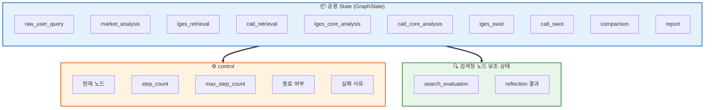
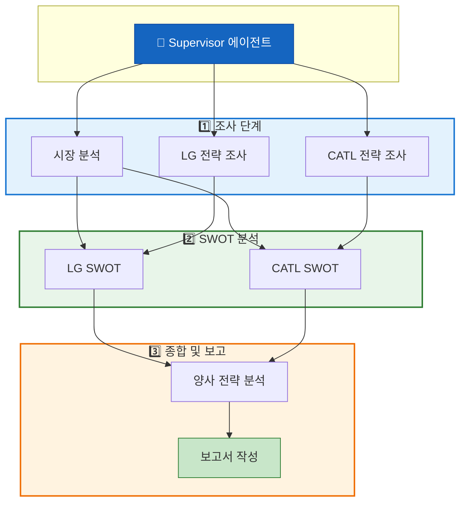

# 설계 산출물

작성일: 2026년 03월 17일
작성자: 최우석, 임수현 
---

# 1. 개요

본 설계는 **배터리 산업의 구조 변화 속에서 LG에너지솔루션과 CATL의 포트폴리오 다각화 전략을 비교**하고, 양사의 SWOT과 시장 전략상의 시사점을 해석한 뒤 **최종 보고서까지 생성하는 8개 에이전트 기반 시스템**을 다룹니다.

전체 흐름은 중앙에서 통제하는 **Supervisor 패턴**을 사용하며, 작업 분배, 실행 순서, 재시도, 종료 조건을 한 곳에서 관리할 수 있도록 했습니다. 상태는 **공용 GraphState**와 실행 제어 필드로 설계해, 현재 노드, 재시도 횟수, 실패 여부, 검색 품질 평가를 추적할 수 있게 두었습니다. **RAG**는 기업별 전략 조사 단계에만 적용하고, LG에너지솔루션 전용 FAISS 1개와 CATL 전용 FAISS 1개를 각각 따로 구축합니다. 두 기업이 ESS, 저가형 배터리, 글로벌 확장 등 공통 키워드를 공유하므로, 기업별 인덱스 분리는 검색 정밀도를 높이는 실무적 선택입니다.

# 2. 서론

### 업계 현황
현재 배터리 업계는 “전기차만 보면 되는” 단계를 지나, ESS, 공급망 현지화, 가격 경쟁력, 저가형 화학계, 재활용 등이 동시에 중요한 구간에 들어와 있습니다. IEA는 배터리 수요가 EV 외 stationary application으로 확장되고 있다고 설명했고, 글로벌 EV 배터리 수요는 중장기적으로도 빠르게 증가할 것으로 전망했습니다. 따라서 업계는 침체라기보다 **수요 구조와 경쟁 방식이 바뀌는 재편 단계**에 가깝습니다.

### 비교의 초점 
이런 환경에서는 “누가 더 많은 EV 배터리를 판매하느냐”보다 **“누가 더 넓은 포트폴리오로 불확실성을 흡수하느냐”**가 더 중요한 질문이 됩니다. LG에너지솔루션은 2025 실적 발표에서 ESS 확대, 북미 중심 운영, LFP, 46시리즈, 로봇 등 비EV 확대를, CATL은 2025 연차보고와 2026년 발표에서 ESS 리더십, sodium-ion, Choco-Swap, 순환경제 강화를 제시했습니다. 두 기업 모두 다각화를 추진하지만 **방식이 다르기 때문에**, 이 차이를 구조적으로 비교하는 것이 설계의 초점이 됩니다.

### 설계 구조로의 연결  
시장과 기업 전략은 최신 자료에 따라 달라지므로 **검색과 검증**이 필요하고, SWOT과 양사 비교는 이미 검증된 결과만 입력으로 받아 **해석과 정리**하는 편이 안정적입니다. 이에 따라 **정보 수집 → 해석 → 문서 작성**을 단계별로 나누는 멀티 에이전트 구조를 선택했습니다. 3장부터는 이 구조를 목표(Goal), 성공 기준(Success Criteria), 작업(Task), 제어 전략(Control Strategy) 순으로 구체화합니다.

# 3. Workflow

본 장에서는 시스템이 **무엇을 달성할지(Goal)**, **어떤 기준으로 성공을 판단할지(Success Criteria)**, **어떤 작업으로 나눌지(Task)**, **실행을 어떻게 제어할지(Control Strategy)** 순으로 정의합니다.

## 3-1. Goal

본 시스템의 Goal은 **배터리 시장의 구조 변화**와 **LG에너지솔루션과 CATL의 포트폴리오 다각화 전략**을 근거 기반으로 비교하여, 두 기업의 SWOT과 시장 전략상의 차이를 **이해하기 쉬운 보고서**로 정리하는 것입니다. 목표는 자료를 많이 모으는 것이 아니라, 시장 배경 → 기업 전략 → SWOT → 비교 분석 → 결론이 **한 흐름으로 연결된 결과**를 만드는 데 있습니다. 최종 산출물은 보고서이며, 달성해야 할 상태는 “양사의 전략적 차이를 판단 가능한 상태”입니다.

## 3-2. Success Criteria

Goal을 검증하기 위해 다음 네 가지 기준을 둡니다.

| 기준 | 내용 |
|------|------|
| **근거성** | 시장 분석과 기업 전략 조사에서 나온 핵심 주장에는 출처가 있어야 하고, 검색/RAG 회수 자료가 주장과 직접 연결되어야 합니다. 검색형 노드에서는 문맥 품질을 평가하고, 필요 시 재검색 또는 재작성으로 이어져 신뢰도를 관리할 수 있어야 합니다. |
| **완결성** | 최종 결과물에 시장 배경, LG와 CATL 전략, 각 기업 SWOT, 양사 비교 분석, 결론이 모두 포함되어야 합니다. SUMMARY와 REFERENCE를 두고, 참고문헌은 실제 사용 자료만 정리합니다. |
| **일관성** | 시장 분석에서 다룬 핵심 변화(예: ESS 확대)가 기업 전략, SWOT, 결론에서도 반영되어야 합니다. SWOT 이후 단계에서는 새 사실을 끼워 넣지 않고, 상위 단계 결과만 입력으로 사용해 논리를 정리합니다. |
| **운영 안정성** | Reflection이 필요한 노드는 재시도와 종료 조건을 명확히 하고, 필요 없는 노드는 선형으로 종료합니다. ExecutionControl에는 `current_node`, `step_count`, `max_step_count`, `end_flag`, `fail_reason`를 두고, Reflection 대상 노드에는 `search_evaluation.retry_count`, `search_evaluation.max_retry`, `search_evaluation.revision_count`, `search_evaluation.max_revision`, `search_evaluation.verdict`를 둡니다. |

## 3-3. Task

Task는 **다섯 단계**로 나누고, 이를 **8개 에이전트**로 매핑합니다.

1. **배터리 시장 환경 변화 파악** → 시장 분석 에이전트  
2. **LG에너지솔루션 전략 조사** → LG 전략 조사 에이전트  
3. **CATL 전략 조사** → CATL 전략 조사 에이전트  
4. **두 기업 SWOT 도출** → LG SWOT과 CATL SWOT 에이전트  
5. **양사 비교 분석 및 보고서 작성** → 양사 전략 분석 에이전트, 보고서 작성 에이전트  

전체 흐름 관리는 Supervisor 에이전트가 담당합니다. 이 구성은 작업 단위가 너무 커서 책임이 흐려지거나, 너무 잘게 나뉘어 복잡해지는 것을 함께 줄이기 위한 선택입니다.

## 3-4. Control Strategy

실행 제어 원칙은 **“검색형은 반복 가능, 해석형은 선형, 편집형은 최종 점검 1회”**입니다.

- **검색형**(시장 분석, LG와 CATL 전략 조사): `질문 정리 → 검색 또는 RAG → 초안 작성 → Reflection → 필요 시 재시도`  
- **해석형**(SWOT, 양사 전략 분석): 이미 정리된 입력만 사용하므로 선형 흐름  
- **편집형**(보고서 작성): 최종 점검용 Reflection 1회  

재시도는 **검색 결과 부족, 문맥 품질 낮음, RETRIEVE/REVISE 판정**인 경우에만 허용하고, 그 외에는 보수적으로 종료해 무한 루프와 불필요한 비용을 줄입니다. 구현 파라미터는 다음과 같이 둡니다.

- 시장 분석: `max_retry=2`, `max_revision=2`
- LG 전략 조사: `max_retry=2`, `max_revision=2`
- CATL 전략 조사: `max_retry=2`, `max_revision=2`
- 보고서 작성: `max_retry=1`, `max_revision=1`
- 전체 실행: `max_step_count=40`

# 4. Workflow → Agent

3장의 Task와 Control Strategy를 **실제 에이전트 단위**로 옮깁니다. 각 에이전트의 역할, 사용 도구, Reflection 적용 여부, 특징을 아래 테이블로 정리합니다.

## 4-1. 에이전트 정의

| 에이전트 | 역할 | 사용 도구 | Reflection | 특징 |
|----------|------|-----------|:----------:|------|
| **Supervisor** | 전체 실행 순서와 품질 게이트를 관리합니다. 어떤 에이전트를 언제 호출할지, 재시도 필요 여부, 다음 단계 진행 여부를 판단합니다. | 없음 | 미적용 | 그래프 상 실행 스케줄러이자 품질 관리자 |
| **시장 분석** | 배터리 산업의 큰 흐름을 정리합니다. EV 수요 속도 조정, ESS 성장, 공급망 지역화, 가격 경쟁, 수요처 다변화 등 외부 환경을 요약하고, 누락된 축이 없는지 점검합니다. | 웹검색 | 적용 | ESS 축을 반드시 포함해야 함 |
| **LG 전략 조사** | 북미 현지화, ESS 확대, LFP, 고전압 미드니켈, LMR, 46시리즈, 로봇 등 비EV 응용 확대를 근거와 함께 구조화합니다. | LG 전용 FAISS, 웹검색 | 적용 | 선택적 다각화형 전략 검증 |
| **CATL 전략 조사** | ESS 리더십, sodium-ion 상용화, battery swap 인프라, 순환경제와 재활용을 하나의 전략 체계로 묶어 정리합니다. | CATL 전용 FAISS, 웹검색 | 적용 | 생태계 확장형 다각화 전략 검증 |
| **LG SWOT 분석** | 시장 분석 결과 + LG 전략 조사 결과만 입력으로 받아 Strength, Weakness, Opportunity, Threat를 정리합니다. | 사용 안 함 | 미적용 | 새 정보 검색 없이 선형 분석 |
| **CATL SWOT 분석** | 시장 분석 결과 + CATL 전략 조사 결과만 받아 SWOT을 구성합니다. 내부 강점과 약점, 외부 기회와 위협을 정리합니다. | 사용 안 함 | 미적용 | LG SWOT과 동일 규칙으로 형식과 관점 맞춤 |
| **양사 전략 분석** | 두 SWOT 결과만 입력으로 사용합니다. 두 기업의 다각화 방향 차이를 해석하고, 비교 축(예: LG는 북미, ESS, 중저가, 인접 시장 / CATL은 ESS, sodium-ion, swap, 순환경제 생태계)을 정리합니다. | 사용 안 함 | 미적용 | 사실 추가 없이 해석만 수행 |
| **보고서 작성** | 최종 결과를 문서로 정리합니다. 요약, 본문 구조, 결론, 참고문헌 형식이 맞는지 점검합니다. | 사용 안 함 | 적용 | 문서 품질 검토용 |

## 4-2. RAG 적용 대상 선정

RAG는 **포트폴리오 다각화 전략 조사 에이전트(LG와 CATL) 두 곳에만** 적용합니다. 이 단계가 문서 근거를 가장 많이 필요로 하고 기업별 자료를 누적 참조해야 하기 때문입니다. 시장 분석은 최신 공개 정보 비중이 높아 웹검색 중심이 효율적이고, SWOT, 비교 분석, 보고서 작성은 상위 결과만 정리하므로 RAG가 필요하지 않습니다.

FAISS는 **LG 전용 1개, CATL 전용 1개**로 분리 구축합니다. 한 인덱스에 두 기업을 넣으면 ESS, LFP, 북미, sodium-ion 등 공통 키워드로 검색 오염이 생길 수 있으므로, 기업별로 나누어 검색 정밀도와 해석 안정성을 함께 높입니다.

## 4-3. 적용할 Embedding 모델

RAG 검색에 사용할 임베딩 모델은 **`BAAI/bge-m3`**로 정합니다. 공개 오픈소스이며 다국어 검색을 지원하고, 한국어와 영어가 혼합된 PDF 검색에 적합합니다. 또한 문서 해시와 임베딩 모델명을 매니페스트에 저장해, 동일 문서와 동일 모델 조합인 경우 FAISS 인덱스를 재생성하지 않고 재사용하도록 합니다.

# 5. Agent

## 5-1. State 흐름

**State의 역할**  
State는 “어떤 정보를 이미 확보했는지”, “지금 어느 단계까지 왔는지”를 기록하는 **공용 작업 메모리**입니다. 각 노드는 State 전체가 아니라 자신이 읽고 쓸 키만 알면 되고, 실패와 재시도도 State에 남겨 흐름 제어가 가능하도록 합니다.

**핵심 State 구성**  
- **공용 데이터**: `raw_user_query`, `market_analysis`, `lges_retrieval`, `catl_retrieval`, `lges_core_analysis`, `catl_core_analysis`, `lges_swot`, `catl_swot`, `comparison`, `report`
- **control**: `current_node`, `step_count`, `max_step_count`, `end_flag`, `fail_reason`
- **검색형 노드 보조**: `search_evaluation`, `reflection`

`lges_retrieval`는 LG 전용 FAISS, `catl_retrieval`는 CATL 전용 FAISS 결과만 담아 기업별로 구분합니다. Reflection 대상 에이전트(시장 분석, LG 전략 조사, CATL 전략 조사, 보고서 작성)에는 `search_evaluation`과 `reflection`을 둬서 Supervisor가 다음 행동을 결정합니다.

- `search_evaluation.verdict`: `pending`, `approved`, `revise`, `retrieve`, `exhausted`
- `search_evaluation.retry_count`: 실제 재실행 횟수
- `search_evaluation.max_retry`: 허용된 최대 재실행 횟수
- `search_evaluation.revision_count`: Reflection이 수정/재검색을 요청한 횟수
- `search_evaluation.max_revision`: 허용된 최대 수정 요청 한도

SWOT과 비교 분석은 선형 단계이므로 `reflection`과 `search_evaluation`을 두지 않고, `ready`와 결과 필드만 유지합니다.

## 5-2. Graph 흐름

에이전트들이 **어떤 순서로 호출되고 데이터가 어떻게 넘어가는지**를 아래 다이어그램과 같이 정의합니다.

**실행 순서**  
Supervisor가 사용자 요청을 받아 실행 계획을 세운 뒤, **조사 단계**(시장 분석, LG 전략 조사, CATL 전략 조사)를 병렬로 수행합니다. 세 노드가 끝나면 Supervisor가 `search_evaluation`과 `reflection`을 확인해 재실행이 필요한 노드만 다시 허용 범위 안에서 반복합니다. 이 단계가 승인되면 **SWOT 단계**로 넘깁니다. LG SWOT은 `market_analysis + lges_core_analysis`, CATL SWOT은 `market_analysis + catl_core_analysis`를 입력으로 받고, **양사 전략 분석** 에이전트가 두 SWOT을 합쳐 다각화 방향, 경쟁력, 리스크를 해석한 뒤, **보고서 작성** 에이전트가 문서로 정리하고 형식 점검 Reflection 1회를 수행합니다.

**설계상의 이유**  
이 흐름은 **검색과 해석을 분리**하기 위한 것입니다. 조사 단계에서는 최신 사실을 찾고, SWOT과 비교 분석에서는 이미 확보된 사실만 재배열하며, 보고서 작성에서는 문서 품질만 다룹니다. 그 결과가 흔들리지 않고, 오류 발생 시에도 어느 노드에서 문제가 생겼는지 추적하기 쉽습니다.

# 6. 결론

본 설계의 **핵심 결정사항**은 다음 네 가지로 정리할 수 있습니다.

| 결정 | 내용 |
|------|------|
| 구조 | Supervisor 패턴으로 전체 흐름을 한 곳에서 통제 |
| 에이전트 | 8개로 역할을 나누어 책임 경계를 명확히 함 |
| RAG와 FAISS | LG와 CATL 포트폴리오 조사 에이전트에만 적용, 기업별 FAISS 1개씩 분리 구축 |
| Reflection | 검색형 에이전트와 보고서 작성 에이전트에만 적용, SWOT과 비교 분석은 선형 |

**배터리 분야 관점**  
LG에너지솔루션과 CATL은 모두 다각화를 추진하지만 방향이 다릅니다. LG는 ESS, 북미 현지화, 제품군 다변화, 비EV 확장 등 **선택적이면서 방어적인 확장** 성격이 강하고, CATL은 ESS, sodium-ion, swap, 순환경제를 **넓은 에너지 생태계 전략**으로 묶는 성격이 더 강합니다. 따라서 이 비교의 핵심은 “누가 더 크냐”보다 “누가 어떤 방식으로 불확실성을 흡수하느냐”에 있습니다.

**Lesson Learned**  
검색이 필요한 단계와 해석이 필요한 단계를 **섞지 않는 것**이 가장 중요합니다. 시장과 기업 전략은 최신 근거가 필요해 웹검색, RAG, Reflection이 필요하고, SWOT과 전략 비교는 입력을 통제하는 선형 구조가 적합합니다. 좋은 멀티 에이전트 설계는 에이전트 수가 아니라, **각 에이전트가 왜 존재하고 어디까지 책임지는지**를 분명히 하는 데서 시작합니다.

